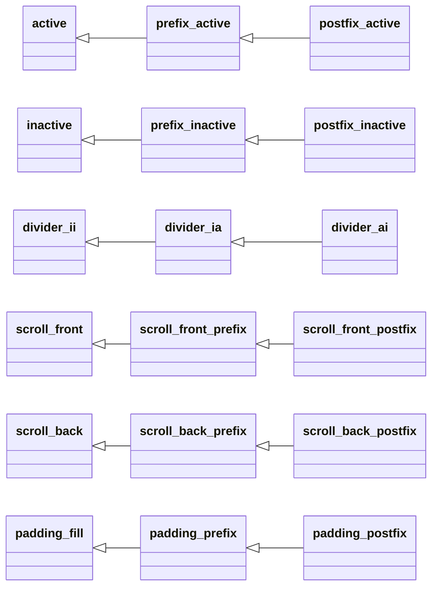
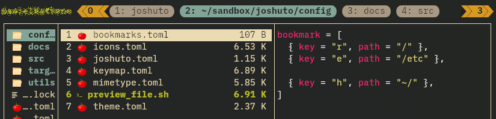

# Theming the Tab-Bar
The tab bar in the title row can be configured in various aspects.
This page explains the tab-related configuration options and gives
configuration examples at the end.

## Elements of the Tab-Bar
Of course, the tab-bar is composed from one or more tabs.
Tabs are separated by a _divider_, and if there are more tabs than fit into the window,
there will be _scroll tags_ at the beginning and at the end of the tab bar.
The scroll tags indicate that there are more tabs and each end's scroll tag shows the number
of tabs that did not fit into the tab-bar on that particular side.

The right scroll tag is always right-aligned.
The space between the right scroll tag and the right-most tab is filled by a "padding" segment.

Furthermore, each tab, the padding segment, and the scroll tags, all have a _prefix_ and a _postfix_.
Prefixes and postfixes are additional sub-elements that 
help to better visualize the tabs and
allow for some more styling options.


The following list shows an example sequence with four tabs
that includes all the possible segments of a tab-bar.

*   <div style="font-family: monospace;">
    <span style="background:#BB0505">&nbsp;[pre]&nbsp;</span>
    <span style="background:#EE2222">&nbsp;[scroll-f]&nbsp;</span>
    <span style="background:#BB0505">&nbsp;[post]&nbsp;</span>&nbsp;&nbsp;(left scroll tag)
    </div>
*   <div style="font-family: monospace;">
    <span style="background:#888888">&nbsp;[pre]&nbsp;</span>
    <span style="background:#AAAAAA">&nbsp;[tab 1]&nbsp;</span>
    <span style="background:#888888">&nbsp;[post]&nbsp;</span>&nbsp;&nbsp;(inactive tab)
    </div>
*   <div style="font-family: monospace;">
    <span style="background:#779999">&nbsp;[ii]&nbsp;</span>&nbsp;&nbsp;(divider between two inactive tabs)
    </div>
*   <div style="font-family: monospace;">
    <span style="background:#888888">&nbsp;[pre]&nbsp;</span>
    <span style="background:#AAAAAA">&nbsp;[tab 2]&nbsp;</span>
    <span style="background:#888888">&nbsp;[post]&nbsp;</span>&nbsp;&nbsp;(inactive tab)
    </div>
*   <div style="font-family: monospace;">
    <span style="background:#77AA77">&nbsp;[ia]&nbsp;</span>&nbsp;&nbsp;(divider before active tab)
    </div>
*   <div style="font-family: monospace;">
    <span style="background:#8888BB">&nbsp;[pre]&nbsp;</span>
    <span style="background:#9090F0">&nbsp;[tab 3]&nbsp;</span>
    <span style="background:#8888BB">&nbsp;[post]&nbsp;</span>&nbsp;&nbsp;(active tab)
    </div>
*   <div style="font-family: monospace;">
    <span style="background:#77AA77">&nbsp;[ai]&nbsp;</span>&nbsp;&nbsp;(divider after active tab)
    </div>
*   <div style="font-family: monospace;">
    <span style="background:#888888">&nbsp;[pre]&nbsp;</span>
    <span style="background:#AAAAAA"> tab 4</span>
    <span style="background:#888888">&nbsp;[post]&nbsp;</span>&nbsp;&nbsp;(inactive tab)
    </div>
*   <div style="font-family: monospace;">
    <span style="background:#CCBB55">&nbsp;[pre]&nbsp;</span>
    <span style="background:#EEDD99">&nbsp;[pad]&nbsp;</span>
    <span style="background:#CCBB55">&nbsp;[post]&nbsp;</span>&nbsp;&nbsp;(padding)
    </div>
*   <div style="font-family: monospace;">
    <span style="background:#BB0505">&nbsp;[pre]&nbsp;</span>
    <span style="background:#EE2222">&nbsp;[scroll-b]&nbsp;</span>
    <span style="background:#BB0505">&nbsp;[post]&nbsp;</span>&nbsp;&nbsp;(right scroll tag)

<!--
<pre>
<span style="background:#BB0505"> pre </span>
<span style="background:#EE2222"> scroll-f </span>
<span style="background:#BB0505"> post </span>
<span style="background:#888888"> pre </span>
<span style="background:#AAAAAA"> tab 1 </span>
<span style="background:#888888"> post </span>
<span style="background:#779999"> ii </span>
<span style="background:#888888"> pre </span>
<span style="background:#AAAAAA"> tab 2 </span>
<span style="background:#888888"> post </span>
<span style="background:#77AA77"> ia </span>
<span style="background:#8888BB"> pre </span>
<span style="background:#9090F0"> tab 3 </span>
<span style="background:#8888BB"> post </span>
<span style="background:#77AA77"> ai </span>
<span style="background:#888888"> pre </span>
<span style="background:#AAAAAA"> tab 4</span>
<span style="background:#888888"> post </span>
<span style="background:#CCBB55"> pre </span>
<span style="background:#EEDD99"> pad </span>
<span style="background:#CCBB55"> post </span>
<span style="background:#BB0505"> pre </span>
<span style="background:#EE2222"> scroll-b </span>
<span style="background:#BB0505"> post </span>
</pre>
-->

## Configuring the Characters
Characters for prefixes, postfixes and some other elements can be configured under a `[tabs.chars]`
section.
This is a complete example for the configuration of the default values:
```toml
[tabs.chars]
active_prefix = " "
active_postfix = " "
inactive_prefix = "["
inactive_postfix = "]"
divider = " "
scroll_front_prefix = ""
scroll_front_postfix = ""
scroll_front_prestring = "«"
scroll_front_poststring = " "
scroll_back_prefix = ""
scroll_back_postfix = ""
scroll_back_prestring = " "
scroll_back_poststring = "»"
padding_prefix = " "
padding_postfix = " "
padding_fill = " "
```
Be aware that all elements for the padding segment are chars and can't be of zero length
or `None`, while the other pre- and postfixes are strings and can also be an empty string.

Further note that the scroll tags also have a `prestring` and `poststring`,
which are strings shown before and after the number in the scroll tag but are still part of the 
tag's "body". While the pre- and postfix can have a separate font style (e.g. color),
the pre- and post-string are styled just as the number.

## Configuring Styles (Colors and Font Styles)
Each element of the tab-bar can be configured with a separate style.
The divider can even be configured with three different styles,
one for dividers between two inactive tabs (`divider_ii`),
one for the divider before the active tab (`divider_ia`),
and one for the divider after the active tab (`divider_ai`).

All styles are sub-elements of `[tabs.styles]`.

To ease configuration, most styles are derived from another style and one only
has to specify the deviation.

The following image visualizes all styles and how they are derived from others.


The left-most styles in the diagram are basic styles which are not 
derived from another style.
The default configuration uses these:

```toml
[tabs.styles]

[tabs.styles.active]
bg = "light_blue"
fg = "black"
bold = true

[tabs.styles.scroll_front]
fg = "yellow"
bold = true

[tabs.styles.scroll_back]
fg = "yellow"
bold = true
```

The remaining base styles use the terminal default background and foreground.
The derived styles are all empty by default and therewith equal to their "root-style".

Hint: If one changes even only one attribute of one of the base styles, the default
is not used anymore. For example, if only `[tabs.styles.active.bg]` is set in
`theme.toml`, the two other defaults (`fg` and `bold`) are not used anymore
from the default configuration and need to be specified explicitly if wanted.
If they are specified, they will fall back to the terminal default style.

## Examples

### Rounded Tabs with Arrow-like Scroll Tags
This styling requires a **nerdfont** being used by the terminal.



This is the configuration that can be copied to `theme.toml`:
```toml
[tabs]

[tabs.chars]
divider = " "
active_prefix = ""
active_postfix = ""
inactive_prefix = ""
inactive_postfix = ""
scroll_front_prefix = ""
scroll_front_postfix = ""
scroll_front_prestring = ""
scroll_front_poststring = " "
scroll_back_prefix = ""
scroll_back_postfix = ""
scroll_back_prestring = " "
scroll_back_poststring = ""

[tabs.styles]

[tabs.styles.active]
fg = "black"
bg = "light_blue"
bold = true

[tabs.styles.active_prefix]
fg = "light_blue"
bg = "reset"

[tabs.styles.inactive]
fg = "black"
bg = "gray"

[tabs.styles.inactive_prefix]
fg = "gray"
bg = "reset"

[tabs.styles.scroll_front]
fg = "black"
bg = "yellow"
bold = true

[tabs.styles.scroll_front_prefix]
fg = "yellow"
bg = "reset"

[tabs.styles.scroll_front_postfix]
invert = true

[tabs.styles.scroll_back]
fg = "black"
bg = "yellow"
bold = true

[tabs.styles.scroll_back_prefix]
fg = "yellow"
bg = "reset"
invert = true

[tabs.styles.scroll_back_postfix]
invert = false
```
