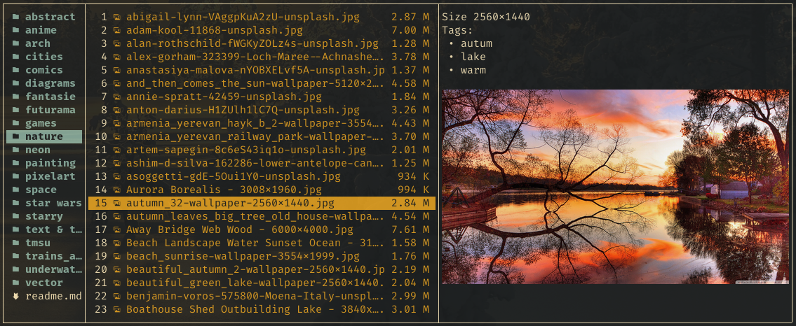

# Image Thumbnails in File Previews
Joshuto does not support image previews directly.
One reason is to keep Joshuto independent of specific display protocols and terminal emulators.

However, Joshuto offers two preview-related hooks which allow to easily implement an
image preview with some simple scripts.
This page explains the integration with [Überzug](https://github.com/seebye/ueberzug),
a Python tool to display images as overlays on a terminal emulator, and integration with [Kitty's Icat](https://sw.kovidgoyal.net/kitty/kittens/icat/).
This exemplary solution shows previews for JPEG and PNG files. 
It has not been tested with MacOS and tmux.

# Image Previews with Überzug
Überzug must be [installed](https://github.com/seebye/ueberzug#installation) for the solution explained here.

## Joshuto Wrapper
First, we need a wrapper script for Joshuto.
Joshuto is not started directly anymore but through that wrapper script.
Place this script in a directory which is in your `$PATH`.
You may name the script `j` or `jo` or whatever you like to type to start Joshuto.
You may also name it `joshuto`, just take care that it
must come before the actual `joshuto` binary in you `$PATH` in that case.

```bash
#!/usr/bin/env bash

if [ -n "$DISPLAY" ] && command -v ueberzug > /dev/null; then
    export joshuto_wrap_id="$$"
    export joshuto_wrap_tmp="$(mktemp -d -t joshuto-wrap-$joshuto_wrap_id-XXXXXX)"
    export joshuto_wrap_ueber_fifo="$joshuto_wrap_tmp/fifo"
    export joshuto_wrap_pid_file="$joshuto_wrap_tmp/pid"
    export joshuto_wrap_preview_meta="$joshuto_wrap_tmp/preview-meta"
    export joshuto_wrap_ueber_identifier="preview"

    function start_ueberzug {
        mkfifo "${joshuto_wrap_ueber_fifo}"
        tail --follow "$joshuto_wrap_ueber_fifo" | ueberzug layer  --parser bash &
        echo "$!" > "$joshuto_wrap_pid_file"
        mkdir -p "$joshuto_wrap_preview_meta"
    }

    function stop_ueberzug {
        ueberzug_pid=`cat "$joshuto_wrap_pid_file"`
        kill "$ueberzug_pid"
        rm -rf "$joshuto_wrap_tmp"
    }

    function show_image {
        >"${joshuto_wrap_ueber_fifo}" declare -A -p cmd=( \
                [action]=add [identifier]="${joshuto_wrap_ueber_identifier}" \
                [x]="${2}" [y]="${3}" \
                [width]="${4}" [height]="${5}" \
                [path]="${1}")
    }

    function remove_image {
        >"${joshuto_wrap_ueber_fifo}" declare -A -p cmd=( \
            [action]=remove [identifier]="${joshuto_wrap_ueber_identifier}")
    }

    function get_preview_meta_file {
        echo "$joshuto_wrap_preview_meta/$(echo "$1" | md5sum | sed 's/ //g')"
    }

    export -f get_preview_meta_file
    export -f show_image
    export -f remove_image
 
    trap stop_ueberzug EXIT QUIT INT TERM
    start_ueberzug
    echo "ueberzug started"
fi

joshuto "$@"
exit $?
```

The script must be _executable_!

This script starts an “ueberzug server” and then Joshuto itself.
It takes care that ueberzug is stopped when
`joshuto` terminates.
Each Joshuto instance will have its own instance of an “ueberzug server”.
The script also provides some functions
and variables which can be used in sub-processes.

## Configuring Hook Scripts
When started with the wrapper script, Joshuto's sub-processes can show and remove a
preview image with Überzug now. Joshuto offers two hooks which will be used for that.

In your `~/.config/joshuto/joshuto.toml`, configure a script for each of these hooks: 

```toml
[preview]
...
preview_shown_hook_script = "~/.config/joshuto/on_preview_shown"
preview_removed_hook_script = "~/.config/joshuto/on_preview_removed"
```

The “shown” script will be called each time a file preview is shown by Joshuto.
The “removed” script will be called each time the file preview disappears in Joshuto.
That is the case if the user selects a file for which no file preview is shown
(either due to missing output of the preview script or due to file size),
if the preview is not cached already and the preview pane is temporarily removed,
or if the selection jumps from a file to a directory.

The “shown” script gets the path of the file being previwed
as first argument and then the x and y coordinate and the width an
height of the preview area as second to fifth parameters.

The “removed” script does not get any arguments.

Keep in mind that the result of the `preview` script you use for textual previews
is cached by Joshuto and not called every time a file is focused, but the “shown” hook is.

## The Hook Scripts
Now we need to create the two hook scripts which have been configured before.

Create these two scripts and make them _executable_!

`~/.config/joshuto/on_preview_shown`:
```bash
#!/usr/bin/env bash

test -z "$joshuto_wrap_id" && exit 1;

path="$1"       # Full path of the previewed file
x="$2"          # x coordinate of upper left cell of preview area
y="$3"          # y coordinate of upper left cell of preview area
width="$4"      # Width of the preview pane (number of fitting characters)
height="$5"     # Height of the preview pane (number of fitting characters)


# Find out mimetype and extension
mimetype=$(file --mime-type -Lb "$path")
extension=$(/bin/echo "${path##*.}" | awk '{print tolower($0)}')

case "$mimetype" in
    image/png | image/jpeg)
        show_image "$path" $x $y $width $height
        ;;
    *)
        remove_image

esac
```

`~/.config/joshuto/on_preview_removed`:
```bash
#!/usr/bin/env bash
test -z "$joshuto_wrap_id" && exit 1;
remove_image
```

The first script shows a preview in case we have a JPEG or PNG file.
If there is already a preview image shown, it will just be replaced.
If we have a file other than JPEG or PNG, any preview which might be
visible is removed.

The second script just removes a preview image in case one is currently shown.

The removal of a preview in the first script is important when the user changes
the selection from one file with a preview to another.
The removal in the second script is important when the user changes the selection
from a file with a preview to a file without a preview or a directory.

That's it. Previewing JPEG and PNG files should work now when the wrapper
script is started.

# Combining Text Preview and Thumbnails
It's possible to combine a textual preview and an image preview.
The wrapper script shown above exports one more function,
`get_preview_meta_file`,
which returns a unique, temporary file location for any path that can be used
to hand over information from the preview script to the hooks script.

In this example, we use that file to store the information on which y-offset
the preview image shall be drawn to place the preview image beneath the textual preview.



Let's say we have this handling for JPEG and PNG files in the **`preview`** script:

```bash
case "$mimetype" in
    
    ...

    image/png | image/jpeg)
        dimension="Size `exiftool "$path" | grep '^Image Size' | awk '{print $4}'`"
        tags=$(tmsu_tag_list)
        echo "$dimension"
        echo "$tags"
        meta_file="$(get_preview_meta_file $path)"
        let y_offset=`printf "${tags}" | sed -n '=' | wc -l`+2
        echo "y-offset $y_offset" > "$meta_file"
        exit 4
        ;;
```
Here, we fetch some data we want as text (dimensions of the image and some tags) and just print it out for
Joshuto to show.
Additionally, we calculate the height of our output and write it to a temporary file, specific for the
current `$path`, which has been provided by the wrapper script via the `get_preview_meta_file` function.

Then we adapt the “preview shown” hook script as follows:
```bash
...

case "$mimetype" in
    image/png | image/jpeg)
        meta_file="$(get_preview_meta_file $path)"
        y_offset=`cat "$meta_file" | grep "y-offset" | awk '{print $2}'`
        y=$(( $y + $y_offset ))
        show_image "$path" $x $y $width $height
        ;;
    *)
        remove_image

esac
```
Here, we again get the path of our temporary file and use that offset information to
display the image preview just below the textual output.

Joshuto will have cached the textual output but all the temporary files will remain until
Joshuto (and the wrapper script) are exited, so they will remain available for the hook scripts.

# Image Previews with Kitty's Icat
The Kitty terminal must be [installed](https://sw.kovidgoyal.net/kitty/binary/#) for the solution explained here.

## Hook Scripts
To preview images in Kitty, you need to create these two scripts and make them executable.

`~/.config/joshuto/on_preview_shown`:
```shell
#!/usr/bin/env bash

TMP_FILE="$HOME/.cache/joshuto/thumbcache.png"

file="$1"
X="$2"
Y="$3"
width="$4"
height="$5"

function image {
	kitty +kitten icat --transfer-mode=file --clear 2>/dev/null
	kitty +kitten icat --transfer-mode=file --place "${width}x${height}@${X}x${Y}" "$1" 2>/dev/null
}

case $(file -b --mime-type "${file}") in
	image/*)
		image "${file}"
		;;
    *)
	    kitty +kitten icat --transfer-mode=file --clear 2>/dev/null
esac
```

`~/.config/joshuto/on_preview_removed.sh`:
```shell
#!/usr/bin/env bash

kitty +kitten icat --transfer-mode=file --clear 2>/dev/null
```

The first script will use icat to place an image on top of joshuto's preview window.
If any images already exist, they will be cleared before showing the image.

The second script simply clears any existing images on the screen.

Thats it. Previewing images should now work whenever you select a file.

## Kitty Demo: 


# Further Options
By extending the scripts, image previews can also be provided for other formats, including
videos, SVGs and whatever else. The wrapper script can be extended to provide a 2nd temporary
file to cache a thumbnail for those file types which cannot be displayed by Überzug directly.

Feel free to provide recipes to include in this documentation.
