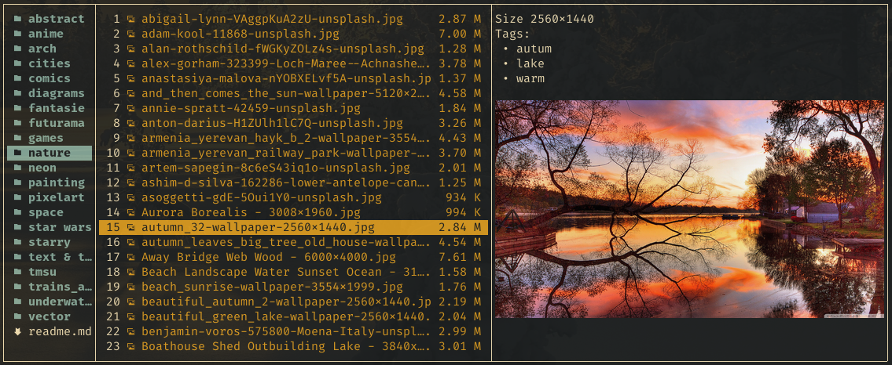

# Combining Text Preview and Thumbnails
When using a wrapper script like used for the Überzug and Überzug++ recipes,
it is possible to hand over information from the textual preview script to
the hook scripts.

With this, it's possible to combine a textual preview and an image preview
by giving a y-offset for the image to the hook script.

The wrapper scripts used in the Überzug and Überzug++ recipes
exports another function,
`get_preview_meta_file`,
which returns a unique, temporary file location for 
each file that may be previewed in Joshuto.

In this example, we use these file locations to store information on which y-offset
the preview image shall be drawn to be placed beneath the textual preview.



## Adapt the Text Preview Script to calculate an Y-Offset

Let's say we have this handling for JPEG and PNG files in the **`preview`** script (the “normal” preview script for textual preview):

```bash
case "$mimetype" in

    ...

    image/png | image/jpeg)
        dimension="Size `exiftool "$path" | grep '^Image Size' | awk '{print $4}'`"
        tags=$(tmsu_tag_list)
        echo "$dimension"
        echo "$tags"
        meta_file=$(get_preview_meta_file "$path")
        let y_offset=`printf "${tags}" | sed -n '=' | wc -l`+2
        echo "y-offset $y_offset" > "$meta_file"
        exit 4
        ;;
```

Here, we fetch some data we want as text (dimensions of the image and some tags) and just print it out for
Joshuto to show like for just a textual preview.
Additionally, we calculate the height of our output and write it to a temporary file, specific for the
current `$path`, which has been provided by the wrapper script via the `get_preview_meta_file` function.

## Adapt the "preview-shown" Script to put the Image at the right Y-Offset

After we have the y-offset available, we adapt the “preview shown” hook script as follows:

```bash
...

case "$mimetype" in
    image/png | image/jpeg)
        meta_file=$(get_preview_meta_file "$path")
        y_offset=`cat "$meta_file" | grep "y-offset" | awk '{print $2}'`
        y=$(( $y + $y_offset ))
        show_image "$path" $x $y $width $height
        ;;
    *)
        remove_image

esac
```

Here, we again get the path of our temporary file and then
use that offset information to
display the image preview just below the textual output.

Joshuto will have cached the textual output but all the temporary files will remain until
Joshuto (and the wrapper script) are exited, so they will remain available for the hook scripts.

